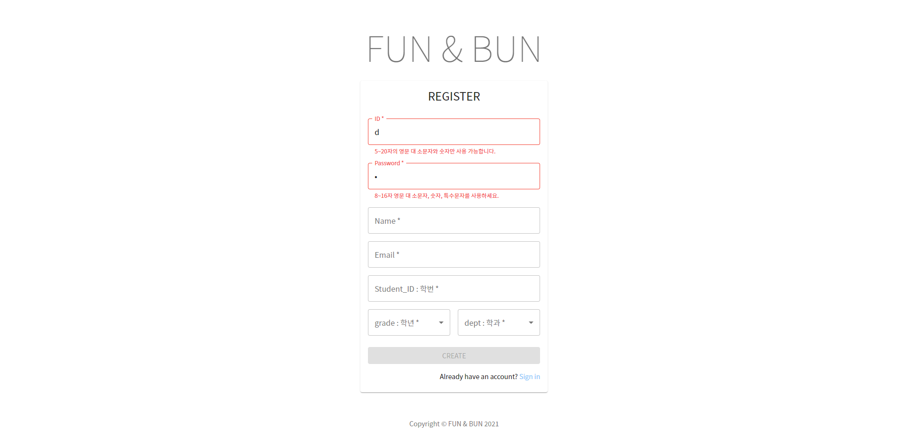
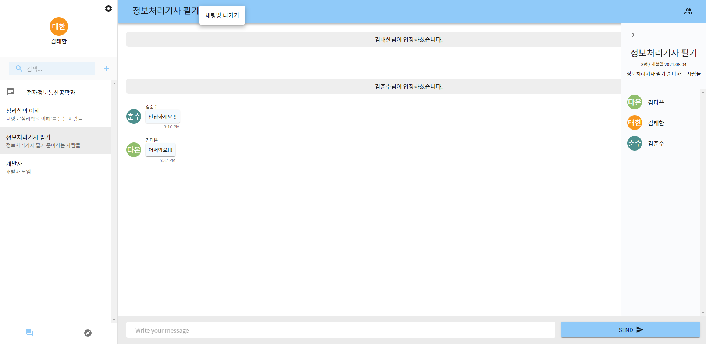
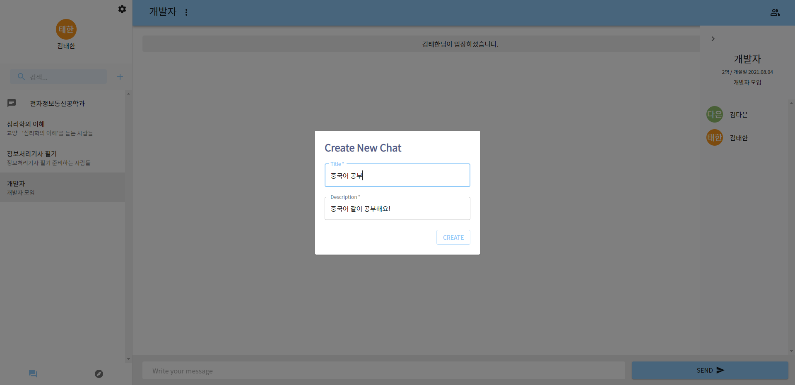
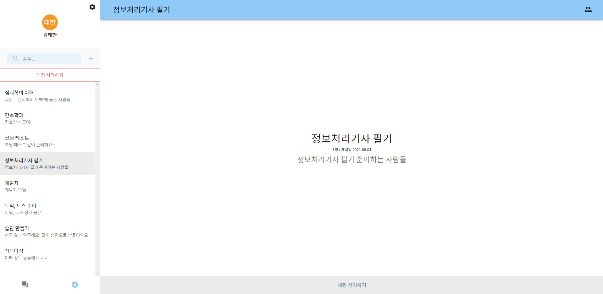
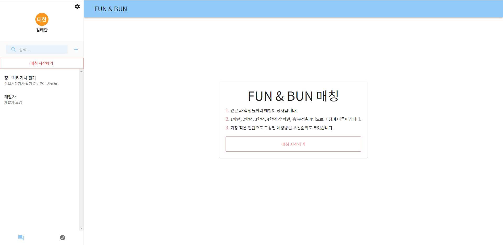
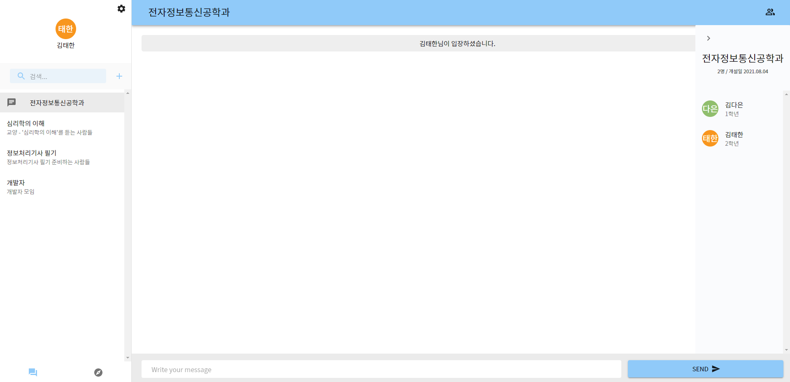
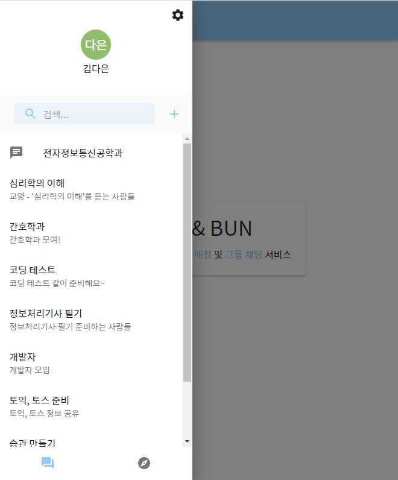
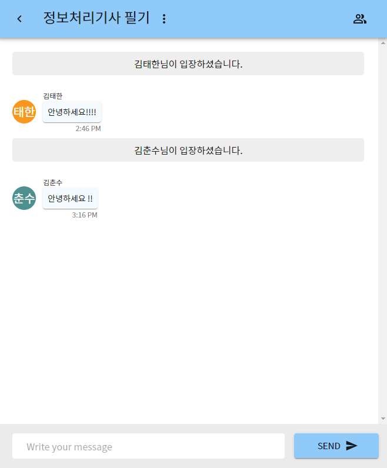
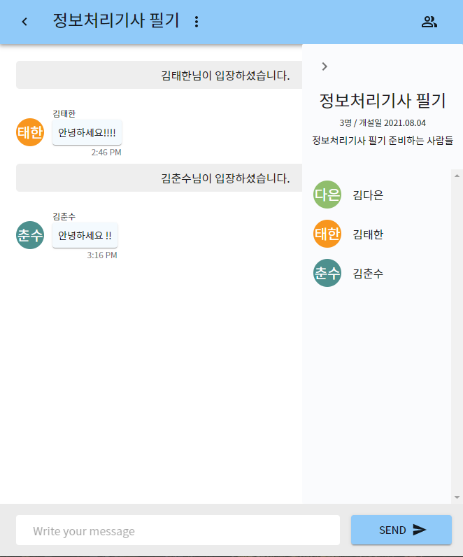

# FUN & BUN

코로나 사태로 인한 비대면 수업으로, 학교 생활에 대한 정보를 얻기 어려운 학생들에게 학과 선후배 간 연결을 통해 정보 교류 및 소통 할 수 있는 환경을 제공해주는 랜덤 매칭 및 그룹채팅 서비스 입니다.

## Stack

- React JS
- Node JS (Express)
- MongoDB / Mongoose
- Material UI
- JSON web tokens
- Axios for API requests
- Websockets (socket.io) for real-time

## Features && Progress

### 사용자 계정

- [x] 로그인
- [x] 회원가입
- [x] 로그아웃
- [x] JSON web tokens 을 이용한 사용자 생성 및 인증
- [ ] 이메일 인증
- [ ] 비밀번호 분실 및 변경
- [ ] 프로필 편집

### 그룹 채팅

- [x] 그룹 생성
- [x] 그룹 가입
- [x] 그룹 나가기
- [x] 그룹 자동 삭제
- [x] 그룹 정보 보기
- [x] 그룹 검색
- [ ] 그룹 정보 편집
- [ ] 그룹 채팅 나간 후 입장 제한

### 랜덤 매칭

- [x] 랜덤 매칭 알고리즘
- [ ] 추가 구성원, 메시지 알림
- [ ] 랜덤 매칭 나가기(2회)

### UI

- [x] 반응형 레이아웃

자세한 내용은 아래에서 확인해주세요.

## Screenshot

### Login & Register

입력 유효성 검사를 위한 즉각적인 피드백으로 사용자 입력을 보호합니다.

</img>

<i>회원가입 화면</i>

사용자를 생성하기 전 다음을 포함한 여러 검사가 백그라운드에서 실행됩니다.

- 이미 존재하는 사용자인지 확인
- 이미 사용하는 이메일인지 확인
- 입력이 올바른 형식인지 확인

### Group Chat

</img>

<i>나의 채팅 화면</i>

사용자가 참여한 채팅을 확인할 수 있습니다.  
오른 쪽 상단의 사람 아이콘을 클릭하면 채팅의 정보를 확인 할 수 있으며, 채팅 제목 옆의 아이콘을 클릭하면 채팅방을 떠날 수 있습니다.  
채팅방의 인원이 존재하지 않을 경우 자동 삭제 됩니다.

</img>

<i>채팅 생성 화면</i>

검색 옆의 '+' 기호를 클릭하면 채팅을 생성할 수 있습니다.

</img>

<i>모든 채팅 화면</i>

존재하는 모든 채팅을 확인할 수 있으며, 찾고 있는 채팅방을 검색할 수 있습니다.

### RandomMatch

</img>

<i>매칭 시작하기 화면</i>

오른쪽 매칭시작하기 버튼을 클릭하면 위와 같은 화면을 볼 수 있습니다.  
매칭은 다음과 같이 이루어집니다.

- 같은 학과의 학생들끼리
- 1학년, 2학년, 3학년, 4학년 각 학년의 1명씩 총 4명
- 우선순위 : 가장 적은 인원의 방, 가장 오래전에 만들어진 방

</img>

<i>매칭 완료 화면</i>

매칭이 완료되면 위와 같은 화면을 볼 수 있습니다.  
매칭 시작하기 버튼은 학과 이름으로 변경되며, 그룹채팅과 마찬가지로 매칭의 정보를 확인할 수 있습니다.

### Responsive design

</img>
</img>
</img>
